# 📐 Schema dữ liệu — Life Hub

> Ứng dụng lưu **toàn bộ dữ liệu** dưới dạng **một object JSON** trong `localStorage`
> (khóa: `life-hub.db.v1`) và đồng bộ tùy chọn ra file `.json` (vd: `life-hub-data.json`).
> Đây là kho dữ liệu dạng **document (NoSQL)**, không phải SQL — các "bảng" dưới đây là các
> mảng/đối tượng con trong object gốc. Liên kết giữa bảng dùng `id` (khóa ngoại).

## Sơ đồ tổng quan (object gốc)

| Khóa | Kiểu | Mô tả |
|------|------|-------|
| `taskColumns` | array | Các cột/trạng thái của bảng Kanban Công việc |
| `todos` | array | Công việc |
| `habits` | array | Thói quen |
| `habitLogs` | object | Lần tick thói quen theo ngày |
| `goals` | array | Mục tiêu |
| `sleep` | array | Nhật ký giấc ngủ |
| `work` | array | Phiên tập trung / giờ làm việc |
| `notes` | array | Ghi chú (dạng block) |
| `journal` | object | Nhật ký theo ngày |
| `finance` | object | Tài chính (gồm 5 bảng con) |
| `activity` | array | Nhật ký thao tác / đăng nhập |
| `settings` | object | Cấu hình người dùng |
| `_taskColsV2` | boolean | Cờ nội bộ (đánh dấu đã bổ sung trạng thái Pending/Cancel) |

---

## 1. `taskColumns` — Cột trạng thái Kanban

| Trường | Kiểu | Bắt buộc | Mô tả |
|--------|------|:---:|-------|
| `id` | string | ✓ | Khóa chính |
| `name` | string | ✓ | Tên hiển thị (vd: "Đang làm") |
| `kind` | enum | ✓ | Loại: `todo` \| `doing` \| `pending` \| `done` \| `cancel` \| `custom` |
| `isDone` | boolean | | `true` cho cột "Hoàn thành" (ghi mốc completedAt) |

## 2. `todos` — Công việc

| Trường | Kiểu | Bắt buộc | Mô tả |
|--------|------|:---:|-------|
| `id` | string | ✓ | Khóa chính |
| `text` | string | ✓ | Tên công việc |
| `description` | string | | Mô tả chi tiết |
| `columnId` | string → `taskColumns.id` | ✓ | Cột hiện tại (khóa ngoại) |
| `done` | boolean | ✓ | Suy ra từ cột có `isDone` |
| `priority` | enum | ✓ | `high` \| `med` \| `low` |
| `due` | string \| null | | Hạn dự kiến (`datetime-local`: `YYYY-MM-DDTHH:mm`) |
| `startedAt` | number \| null | | Mốc bắt đầu làm (timestamp ms) — set khi vào cột `doing` |
| `completedAt` | number \| null | | Mốc hoàn thành (timestamp ms) |
| `cancelledAt` | number \| null | | Mốc hủy (timestamp ms) |
| `history` | array<HistoryEntry> | ✓ | Lịch sử mọi lần đổi trạng thái |
| `createdAt` | number | ✓ | Thời điểm tạo (timestamp ms) |

**HistoryEntry** (phần tử của `todos.history`)

| Trường | Kiểu | Mô tả |
|--------|------|-------|
| `from` | string \| null → `taskColumns.id` | Cột nguồn (`null` = tạo mới) |
| `to` | string → `taskColumns.id` | Cột đích |
| `at` | number | Thời điểm đổi (timestamp ms) |

## 3. `habits` — Thói quen

| Trường | Kiểu | Bắt buộc | Mô tả |
|--------|------|:---:|-------|
| `id` | string | ✓ | Khóa chính |
| `name` | string | ✓ | Tên thói quen |
| `icon` | string (emoji) | ✓ | Biểu tượng |
| `note` | string | | Ghi chú |
| `createdAt` | number | ✓ | Thời điểm tạo |

## 4. `habitLogs` — Lần tick thói quen

Đối tượng lồng nhau: `{ [habitId]: { [ "YYYY-MM-DD" ]: true } }`

| Cấp | Khóa | Giá trị | Mô tả |
|-----|------|---------|-------|
| 1 | `habitId` → `habits.id` | object | Một thói quen |
| 2 | ngày `YYYY-MM-DD` | `true` | Đã hoàn thành ngày đó (xóa key = chưa làm) |

## 5. `goals` — Mục tiêu

| Trường | Kiểu | Bắt buộc | Mô tả |
|--------|------|:---:|-------|
| `id` | string | ✓ | Khóa chính |
| `title` | string | ✓ | Tên mục tiêu |
| `scope` | enum | ✓ | `day` \| `week` \| `month` \| `year` |
| `period` | string | ✓ | Kỳ áp dụng: `D:YYYY-MM-DD` \| `W:YYYY-MM-DD` \| `M:YYYY-MM` \| `Y:YYYY` |
| `done` | boolean | ✓ | Đã hoàn thành |
| `progress` | number (0–100) | ✓ | Tiến độ thủ công (khi không có subtask) |
| `subtasks` | array<Subtask> | ✓ | Công việc chi tiết |
| `createdAt` | number | ✓ | Thời điểm tạo |

**Subtask** (phần tử của `goals.subtasks`)

| Trường | Kiểu | Mô tả |
|--------|------|-------|
| `id` | string | Khóa chính |
| `text` | string | Nội dung |
| `done` | boolean | Trạng thái (dùng khi không liên kết) |
| `taskId` | string \| null → `todos.id` | Liên kết tới công việc thật; nếu có, `done` lấy theo task |

## 6. `sleep` — Nhật ký giấc ngủ

| Trường | Kiểu | Bắt buộc | Mô tả |
|--------|------|:---:|-------|
| `id` | string | ✓ | Khóa chính |
| `date` | string `YYYY-MM-DD` | ✓ | Ngày (mỗi ngày 1 bản ghi) |
| `bedtime` | string `HH:mm` | ✓ | Giờ đi ngủ |
| `waketime` | string `HH:mm` | ✓ | Giờ thức dậy (tự xử lý qua đêm) |
| `quality` | number (1–5) | ✓ | Chất lượng |
| `note` | string | | Ghi chú |

## 7. `work` — Phiên tập trung / giờ làm việc

| Trường | Kiểu | Bắt buộc | Mô tả |
|--------|------|:---:|-------|
| `id` | string | ✓ | Khóa chính |
| `date` | string `YYYY-MM-DD` | ✓ | Ngày |
| `minutes` | number | ✓ | Số phút |
| `project` | string | ✓ | Tên việc/dự án |
| `note` | string | | Ghi chú |
| `createdAt` | number | ✓ | Thời điểm tạo |

## 8. `notes` — Ghi chú (dạng block)

| Trường | Kiểu | Bắt buộc | Mô tả |
|--------|------|:---:|-------|
| `id` | string | ✓ | Khóa chính |
| `title` | string | | Tiêu đề |
| `blocks` | array<Block> | ✓ | Nội dung dạng khối |
| `pinned` | boolean | ✓ | Ghim lên đầu |
| `updatedAt` | number | ✓ | Lần sửa gần nhất |

**Block** (phần tử của `notes.blocks`)

| Trường | Kiểu | Mô tả |
|--------|------|-------|
| `id` | string | Khóa chính |
| `type` | enum | `text` \| `h1` \| `h2` \| `h3` \| `bullet` \| `number` \| `todo` \| `toggle` \| `quote` \| `divider` |
| `text` | string | Nội dung khối |
| `checked` | boolean | (chỉ `todo`) đã đánh dấu |
| `collapsed` | boolean | (chỉ `toggle`) đang thu gọn |
| `content` | string | (chỉ `toggle`) nội dung bên trong |

## 9. `journal` — Nhật ký theo ngày

Đối tượng: `{ [ "YYYY-MM-DD" ]: JournalEntry }`

| Trường | Kiểu | Mô tả |
|--------|------|-------|
| `mood` | string (emoji) | Tâm trạng: 😄 🙂 😐 😕 😢 |
| `text` | string | Nội dung nhật ký |
| `gratitude` | string | Điều biết ơn |

---

## 10. `finance` — Tài chính (5 bảng con)

### 10.1 `finance.accounts` — Tài khoản / ví

| Trường | Kiểu | Bắt buộc | Mô tả |
|--------|------|:---:|-------|
| `id` | string | ✓ | Khóa chính |
| `name` | string | ✓ | Tên ví/tài khoản |
| `icon` | string (emoji) | ✓ | Biểu tượng |
| `type` | string | ✓ | Loại: `cash` \| `other` … |
| `initial` | number | ✓ | Số dư ban đầu |
| `createdAt` | number | ✓ | Thời điểm tạo |

> Số dư hiện tại = `initial` + thu − chi ± chuyển khoản (tính từ `finance.tx`).

### 10.2 `finance.categories` — Danh mục thu/chi

| Trường | Kiểu | Bắt buộc | Mô tả |
|--------|------|:---:|-------|
| `id` | string | ✓ | Khóa chính |
| `name` | string | ✓ | Tên danh mục |
| `icon` | string (emoji) | ✓ | Biểu tượng |
| `kind` | enum | ✓ | `expense` \| `income` |

### 10.3 `finance.tx` — Giao dịch

| Trường | Kiểu | Bắt buộc | Mô tả |
|--------|------|:---:|-------|
| `id` | string | ✓ | Khóa chính |
| `type` | enum | ✓ | `income` \| `expense` \| `transfer` |
| `amount` | number | ✓ | Số tiền (luôn dương) |
| `accountId` | string → `finance.accounts.id` | ✓ | Ví nguồn (hoặc ví của thu/chi) |
| `toAccountId` | string \| null → `finance.accounts.id` | | Ví đích (chỉ khi `transfer`) |
| `categoryId` | string \| null → `finance.categories.id` | | Danh mục (null khi `transfer`) |
| `date` | string `YYYY-MM-DD` | ✓ | Ngày giao dịch |
| `note` | string | | Ghi chú |
| `createdAt` | number | ✓ | Thời điểm tạo |

### 10.4 `finance.budgets` — Ngân sách tháng

Đối tượng: `{ [categoryId]: monthlyAmount }`

| Khóa | Giá trị | Mô tả |
|------|---------|-------|
| `categoryId` → `finance.categories.id` | number | Hạn mức chi hằng tháng cho danh mục |

### 10.5 `finance.savings` — Mục tiêu tiết kiệm

| Trường | Kiểu | Bắt buộc | Mô tả |
|--------|------|:---:|-------|
| `id` | string | ✓ | Khóa chính |
| `name` | string | ✓ | Tên mục tiêu |
| `icon` | string (emoji) | ✓ | Biểu tượng |
| `target` | number | ✓ | Số tiền mục tiêu |
| `saved` | number | ✓ | Đã tiết kiệm |
| `deadline` | string \| null `YYYY-MM-DD` | | Hạn |
| `createdAt` | number | ✓ | Thời điểm tạo |

---

## 11. `activity` — Nhật ký thao tác

| Trường | Kiểu | Bắt buộc | Mô tả |
|--------|------|:---:|-------|
| `id` | string | ✓ | Khóa chính |
| `ts` | number | ✓ | Thời điểm (timestamp ms) |
| `type` | enum | ✓ | Loại thao tác (xem bên dưới) |
| `detail` | string | | Mô tả chi tiết |

**Giá trị `type`:** `session_start`, `navigate`, `task_add`, `task_move`, `task_edit`,
`task_delete`, `column_add`, `column_delete`, `habit_add`, `habit_edit`, `habit_tick`,
`goal_add`, `goal_complete`, `goal_subtask_add`, `sleep_log`, `focus_log`,
`journal_save`, `note_save`, `finance_tx_add`, `finance_tx_edit`, `finance_tx_delete`,
`finance_budget`, `finance_account`, `finance_saving`.

> Giới hạn tối đa 4000 bản ghi (cũ nhất bị cắt bớt).

## 12. `settings` — Cấu hình

| Trường | Kiểu | Mặc định | Mô tả |
|--------|------|----------|-------|
| `theme` | enum | `light` | `light` \| `dark` |
| `name` | string | `""` | Tên người dùng |
| `currency` | enum | `₫` | `₫` \| `$` \| `€` \| `£` \| `¥` |

---

## 🔗 Quan hệ khóa ngoại (tóm tắt)

| Từ | Trường | Tới |
|----|--------|-----|
| `todos` | `columnId`, `history[].from/to` | `taskColumns.id` |
| `goals.subtasks` | `taskId` | `todos.id` |
| `habitLogs` | khóa cấp 1 | `habits.id` |
| `finance.tx` | `accountId`, `toAccountId` | `finance.accounts.id` |
| `finance.tx` | `categoryId` | `finance.categories.id` |
| `finance.budgets` | khóa | `finance.categories.id` |

## 📌 Quy ước chung

- **Khóa `id`**: chuỗi sinh tự động dạng `base36(timestamp) + random` (≈ 12–13 ký tự).
- **Timestamp**: số mili-giây (`Date.now()`), trừ các trường ngày dùng chuỗi `YYYY-MM-DD`.
- **Xóa mềm**: không có — bản ghi bị xóa khỏi mảng. Riêng thói quen "bỏ tick" = xóa key ngày.
- **Migration**: hàm `migrate()` trong `js/store.js` tự nâng cấp dữ liệu cũ khi mở app.

---

## 🗺️ Sơ đồ ERD

> Khi chuẩn hóa sang quan hệ, các mảng/đối tượng lồng nhau (history, subtasks, blocks,
> habitLogs, budgets, journal) được tách thành bảng riêng. Schema SQL đầy đủ: [`schema.sql`](schema.sql).

```mermaid
erDiagram
    TASK_COLUMNS  ||--o{ TODOS          : "chứa"
    TASK_COLUMNS  ||--o{ TODO_HISTORY   : "to_column"
    TODOS         ||--o{ TODO_HISTORY   : "ghi log"
    TODOS         |o--o{ GOAL_SUBTASKS  : "liên kết"
    GOALS         ||--o{ GOAL_SUBTASKS  : "chi tiết"
    HABITS        ||--o{ HABIT_LOGS     : "tick theo ngày"
    NOTES         ||--o{ NOTE_BLOCKS    : "gồm block"
    ACCOUNTS      ||--o{ TRANSACTIONS   : "ví nguồn"
    ACCOUNTS      |o--o{ TRANSACTIONS   : "ví đích"
    CATEGORIES    ||--o{ TRANSACTIONS   : "phân loại"
    CATEGORIES    ||--o| BUDGETS        : "hạn mức"

    TASK_COLUMNS {
        string id PK
        string name
        string kind
        bool   is_done
        int    position
    }
    TODOS {
        string id PK
        string text
        string description
        string column_id FK
        bool   done
        string priority
        datetime due
        bigint started_at
        bigint completed_at
        bigint cancelled_at
        bigint created_at
    }
    TODO_HISTORY {
        string id PK
        string todo_id FK
        string from_column_id FK
        string to_column_id FK
        bigint at
    }
    HABITS {
        string id PK
        string name
        string icon
        string note
        bigint created_at
    }
    HABIT_LOGS {
        string habit_id PK,FK
        date   log_date PK
        bool   done
    }
    GOALS {
        string id PK
        string title
        string scope
        string period
        bool   done
        int    progress
        bigint created_at
    }
    GOAL_SUBTASKS {
        string id PK
        string goal_id FK
        string text
        bool   done
        string task_id FK
    }
    SLEEP_LOGS {
        string id PK
        date   log_date UK
        time   bedtime
        time   waketime
        int    quality
        string note
    }
    WORK_SESSIONS {
        string id PK
        date   log_date
        int    minutes
        string project
        string note
        bigint created_at
    }
    NOTES {
        string id PK
        string title
        bool   pinned
        bigint updated_at
    }
    NOTE_BLOCKS {
        string id PK
        string note_id FK
        int    position
        string type
        string text
        bool   checked
        bool   collapsed
        string content
    }
    JOURNAL_ENTRIES {
        date   entry_date PK
        string mood
        string text
        string gratitude
    }
    ACCOUNTS {
        string id PK
        string name
        string icon
        string type
        numeric initial
        bigint created_at
    }
    CATEGORIES {
        string id PK
        string name
        string icon
        string kind
    }
    TRANSACTIONS {
        string id PK
        string type
        numeric amount
        string account_id FK
        string to_account_id FK
        string category_id FK
        date   tx_date
        string note
        bigint created_at
    }
    BUDGETS {
        string category_id PK,FK
        numeric monthly_amount
    }
    SAVINGS_GOALS {
        string id PK
        string name
        string icon
        numeric target
        numeric saved
        date   deadline
        bigint created_at
    }
    ACTIVITY_LOG {
        string id PK
        bigint ts
        string type
        string detail
    }
    SETTINGS {
        int    id PK
        string theme
        string name
        string currency
    }
```

> **Ghi chú quan hệ:** `||` = một & bắt buộc, `o{` = nhiều (0..n), `|o` = không hoặc một
> (khóa ngoại cho phép NULL — vd `transactions.to_account_id`, `goal_subtasks.task_id`).
> Các bảng `SLEEP_LOGS`, `WORK_SESSIONS`, `JOURNAL_ENTRIES`, `SAVINGS_GOALS`,
> `ACTIVITY_LOG`, `SETTINGS` độc lập (không có khóa ngoại).
